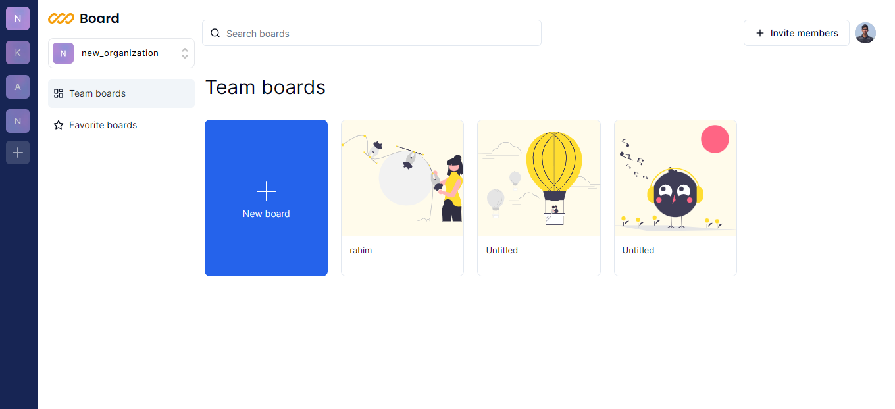

Clone the project

```bash
  git clone https://github.com/Imranul-hoque/board-collaboaration.git
```

Go to the project directory

```bash
  cd my-project
```

Install dependencies

```bash
  npm install
```

Start the server

```bash
  npm run start
```


## Usage

1. setup backend for convex real time database 
2. Run the application: `npm start` (or `yarn start`).
3. Open the app in your web browser: `http://localhost:3000`.


## Folder Structure

**Convex** : It will handle backend side of application

**Provider** : provider folder is only concern for application provider

**App** : That one is main for the app router in next js. This folder is so important for file based routing system

**Components** : All utility functions goes into components folder


## Contact

For questions or support, please contact [Your Name] at [imran.contuct@gmail.com].

# Hi, I'm Imranul Hoque! 👋


## 🛠 Tech
`Javascript` `Nextjs` `Tailwindcss` `Typescript` `Nodejs` `Nestjs` `Convex` and related tech


## Live Collaboration




## User Authentication and Authorization:
Implement secure user authentication to allow users to create accounts and log in.

## Real-time Collaboration: 
Collaborate effortlessly with team members, clients, or friends in real-time. Witness the magic unfold as everyone contributes simultaneously to the virtual whiteboard.

## Multi-User Drawing: 
CollaboraSketch supports multiple users drawing on the same canvas simultaneously. Whether you're sketching out project plans or doodling during a virtual meeting, everyone's creativity is captured in real-time.

## Interactive Tools: 
Utilize a variety of interactive drawing tools, including pens, shapes, colors, and text, to express your ideas with precision and creativity. The intuitive interface ensures a smooth and enjoyable drawing experience for users of all skill levels.

## Dynamic Color Palette: 
Choose from a dynamic color palette to add flair to your drawings. Express emotions, highlight key points, or color-code ideas to make your collaborative sessions more engaging and visually appealing.

## Persistent Whiteboards: 
Save and revisit your collaborative masterpieces. CollaboraSketch allows you to create and manage multiple whiteboards, ensuring that your creative work is never lost, and you can pick up right where you left off.

## User-Friendly Interface: 
The app boasts a user-friendly interface that simplifies navigation and encourages creativity. Accessible drawing tools and clear controls make collaboration a breeze, even for users new to virtual whiteboard applications.


